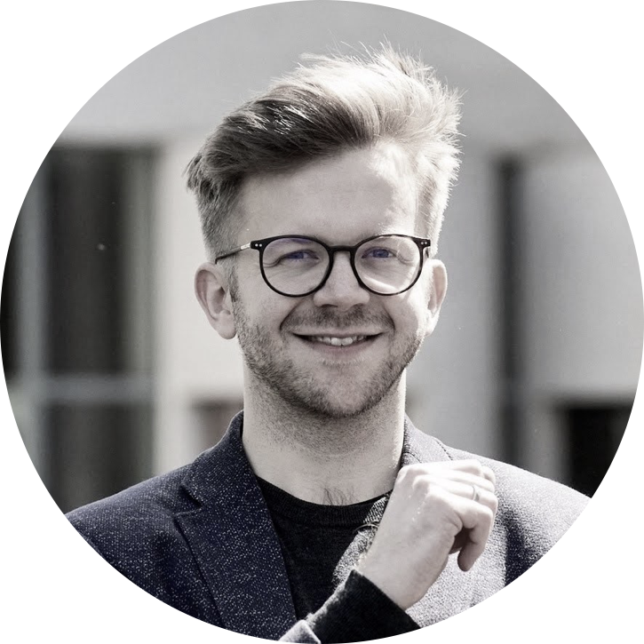

<!-- <table style="width:90%;max-width:800px;border:0px;border-spacing:0px;border-collapse:separate;margin-right:auto;margin-left:auto;">
	<tr> 
		<td align="center" style="padding:2.5%;width:30%">
			
		</td>
		<td>
			<strong>Wolfram Barfuss</strong> 
			Argelander-Professor of Integrated Systems Modeling for Sustainability Transitions 
			<small>Rock | and | Roll <i class="bi bi-award-fill"></i> </small>
		</td>
	</tr>
</table> -->

<table style="width:100%;max-width:800px;border:0px;border-spacing:0px;border-collapse:separate;margin-right:auto;margin-left:auto;">
	<tr> 
	<!-- <td align="center" style="padding:2.5%;width:30%">
		
	</td> -->
	<td>
		<strong>Paula Tittel</strong> <small>(Nov 2023 - Feb 2024) </small>  
		Visiting student researcher 
		<small>
		Next step: Master studies 
		<!-- <a href="https://wbarfuss.github.io"><i class="bi bi-link-45deg"></i></a> 
		<a href="mailto:wbarfuss@uni-bonn.de"><i class="bi bi-envelope-fill"></i></a> 
		<a href="https://scholar.google.com/citations?hl=en&user=ZAqFy78AAAAJ"><i class="bi bi-book-fill"></i></a>
		<i class="fa-brands fa-google-scholar"></i> 
		<a href="https://github.com/wbarfuss"><i class="bi bi-github"></i></a> 
		<a href="https://www.linkedin.com/in/wolfram-barfuss/"><i class="bi bi-linkedin"></i></a> 
		<a href="https://twitter.com/WolframBarfuss"><i class="bi bi-twitter"></i></a>  -->
		</small>
	</td>
	</tr>
	<tr>
		<td style="height: 20px;"></td>
	</tr>
</table>

