<!-- ## Working papers -->

## Peer-reviewed

[2023](publications.html#2023) |
[2022](publications.html#2022) |
[2021](publications.html#2021) |
[2020](publications.html#2020) |
[2019](publications.html#2019) |
[2018](publications.html#2018) |
[2017](publications.html#2017) |
[2016](publications.html#2016) 

<h3 id="2024">2024 | <a href="#page-top" style="text-decoration: none">🔝</a></h3> 

**Collective Cooperative Intelligence** 
*by* **Barfuss W**, Flack J, Gokhale CS, Hammond L, Hilbe C, Hughes E, Leibo JZ, Lenearts T, Leonard N, Levin S, Madhushani U, McAvoy A, Meylahn JM, Santos FP, accepted for publication *in* Proc. Natl. Acad. Sci. U.S.A.

**Unilateral incentive alignment in two-player stochastic games**
*by* Alex McAvoy A, Madhushani U, Hilbe C, Chatterjee K, **Barfuss W**, Su Q, Leonard NE, Plotkin JB, accepted for publication *in* Proc. Natl. Acad. Sci. U.S.A.

[Moderate confirmation bias enhances collective decision-making](https://www.biorxiv.org/content/10.1101/2023.11.21.568073v1.full)
*by* **Bergerot C**, **Barfuss W**, Romanczuk P, accepted for publication *in* PLOS Computational Biology

<h3 id="2023">2023 | <a href="#page-top" style="text-decoration: none">🔝</a></h3> 

*We propose a modeling framework for World-Earth System resilience based on the notion of non-equilibirum pathway resilience.*

<a href="https://iopscience.iop.org/article/10.1088/1748-9326/ace91d/meta">
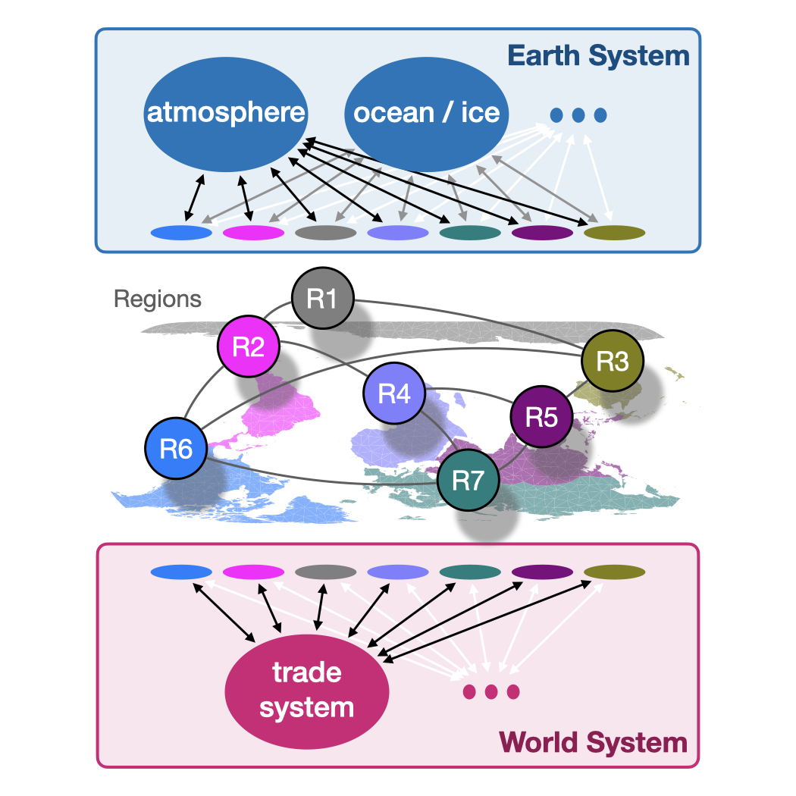
</a>

[A modeling framework for World-Earth System resilience: Exploring social inequality and earth system tipping points](https://iopscience.iop.org/article/10.1088/1748-9326/ace91d/meta)
*by* Anderies JM, **Barfuss W**, Donges JF, Fetzer I, Heitzig J, Rockström J 
*in* Environ. Res. Lett. 18 095001 (2023) 
[doi](https://doi.org/10.1088/1748-9326/ace91d) | [preprint](https://arxiv.org/abs/2204.04471)

---

*We provide multi-disciplinary perspectives on adaptivity in dynamic systems.*

<a href="https://arxiv.org/abs/2303.01459">
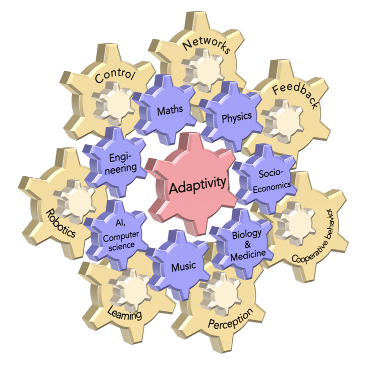
</a>

[Perspectives on adaptive dynamical systems](https://arxiv.org/abs/2303.01459)
*by* Sawicki J, Berner R, Loos SAM, Anvari M, Bader R, **Barfuss W**, Botta N, Brede N, Franović I, Gauthier DJ, Goldt S, Hajizadeh A, Hövel P, Karin O, Lorenz-Spreen P, Miehl C, Mölter J, Olmi S, Schöll E, Seif A, Tass PA, Volpe G, Yanchuk S, Kurths J 
*in* Chaos, 33, 7 (2023)  
[doi](https://doi.org/10.1063/5.0147231) | [preprint](https://arxiv.org/abs/2303.01459) | [scilight](https://doi.org/10.1063/10.0020288)

---

*We show that intrinsic stochastic fluctuations make classical temporal-difference reinforcement learning with 𝜖-greedy strategies highly cooperative.*

<a href="https://www.nature.com/articles/s41598-023-27672-7">
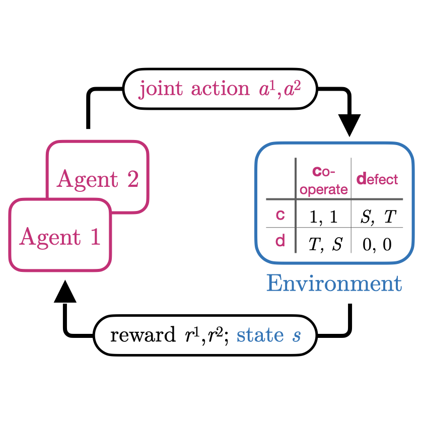
</a>

[Intrinsic fluctuations of reinforcement learning promote cooperation](https://www.nature.com/articles/s41598-023-27672-7)
*by* **Barfuss W**, Meylahn J
*in* Sci Rep 13, 1309 (2023)  
[doi](https://doi.org/10.1038/s41598-023-27672-7) | [preprint](https://arxiv.org/pdf/2209.01013) | [code](https://github.com/wbarfuss/intrinsic-fluctuations-cooperation) | [zenodo](https://doi.org/10.5281/zenodo.7303593)

---

<h3 id='2022'>2022 | <a href="#page-top" style="text-decoration: none">🔝</a></h3> 

*We refined the dynamics of collective learning to account for agents with only partial observability or likewise uncertaint environments.*

<a href="https://arxiv.org/abs/2109.07259">
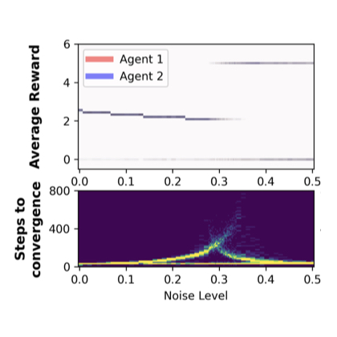
</a>

[Modeling the effects of environmental and perceptual uncertainty using deterministic reinforcement learning dynamics with partial observability](https://arxiv.org/abs/2109.07259)
*by* **Barfuss W**, Mann RP
*in* Physical Review E 105, 3, 034409 (2022)  
[doi](https://doi.org/10.1103/PhysRevE.105.034409) | [preprint](https://arxiv.org/pdf/2109.07259.pdf) | [code](https://github.com/wbarfuss/POLD) | [zenodo](https://doi.org/10.5281/zenodo.6361994)

---

*I discuss how dynamical system models can form an intermedite level of abstraction for an improved understanding of multi-agent systems reinforcement learning.* 

<a href="https://link.springer.com/article/10.1007%2Fs00521-021-06117-0">
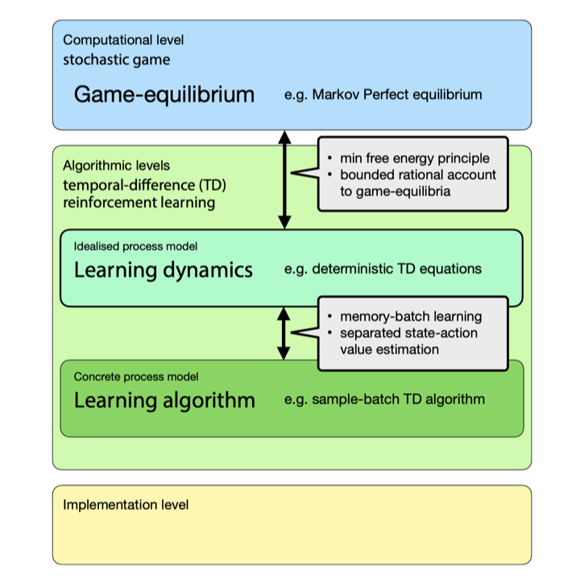
</a>

[Dynamical systems as a level of cognitive analysis of multi-agent learning - Algorithmic foundations of temporal-difference learning dynamics](https://link.springer.com/article/10.1007%2Fs00521-021-06117-0) 
*by* **Barfuss W** 
*in* Neural Computing & Applications 34, 1653-1671 (2022)  
[doi](https://doi.org/10.1007/s00521-021-06117-0) | [code](https://github.com/wbarfuss/CognitiveLevels) | [zenodo](https://doi.org/10.5281/zenodo.4982727)

---

<h3 id='2021'>2021 | <a href="#page-top" style="text-decoration: none">🔝</a></h3> 

*We propose a system to bring order into modelling approaches for human-environment interactions up to the planetary scale.*

<a href="https://esd.copernicus.org/articles/12/1115/2021">
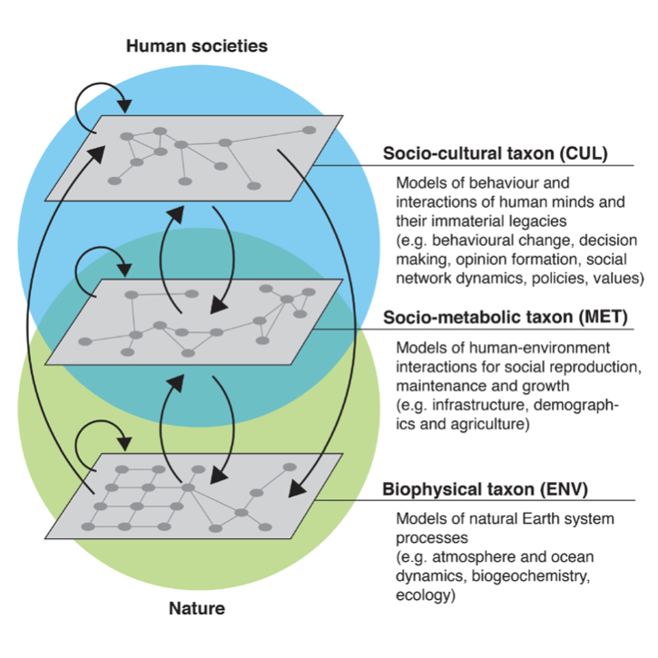
</a>

[Taxonomies for structuring models for World-Earth system analysis of the Anthropocene: subsystems, their interactions and social-ecological feedback loops](https://esd.copernicus.org/articles/12/1115/2021)
*by* Donges JF, Lucht W, Cornell SE, Heitzig J, **Barfuss W**, Lade SJ, Schlüter M 
*in* Earth System Dynamics 12, 1115–1137 (2021)  
[doi](https://doi.org/10.5194/esd-12-1115-2021) 
<!-- | [PNAS Journal Club](http://blog.pnas.org/2021/12/a-guidebook-to-incorporate-changing-human-behaviors-into-planetary-models/) -->

---

*We argue that the study of collective behavior must rise to a “crisis discipline” just as medicine, conservation, and climate science have, with a focus on providing actionable insight to policymakers and regulators for the stewardship of social systems.*

<a href="https://www.pnas.org/content/118/27/e2025764118">
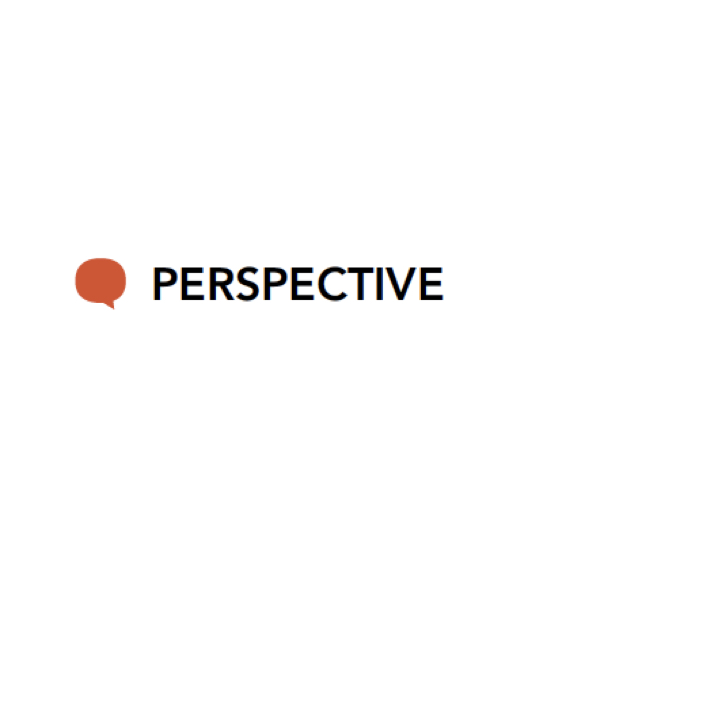
</a>

[Stewardship of global collective behavior](https://www.pnas.org/content/118/27/e2025764118)
*by* Bak-Coleman J, Alfano M, **Barfuss W**, Bergstrom C, Centeno MA, Couzin ID, Donges JF, Galesic M, Gersick AS, Jacquet J, Kao A, Moran RE, Romanczuk P, Rubenstein DI, Tombak KJ, Van Bavel JJ, Weber EU
*in* Proc. Natl. Acad. Sci. U.S.A., 118(27), e2025764118 (2021)  
[doi](https://doi.org/10.1073/pnas.2025764118) | [interview](https://perspective-daily.de/article/1773/quhPydGw)

---

*I discuss questions how to bridge different perspective on modeling multi-agent reinforcement learning as dynamical systems.* 

[Towards a unified treatment of the dynamics of collective learning](https://drive.google.com/a/google.com/file/d/1ZewiyY7KtcPuNQ0LtZyB_31IdkMr8Oxj/view?usp=sharing)
*by* **Barfuss W**
*in* AAAI Spring Symposium [Challenges and Opportunities for Multi-Agent Reinforcement Learning (COMARL)](https://sites.google.com/view/comarl-aaai-2021/home) (2021)  
[slides](../static/assets/pdfs/Barfuss20210322_COMARL.pdf)

---

<h3 id='2020'>2020 | <a href="#page-top" style="text-decoration: none">🔝</a></h3> 

*We show how caring for the future can transform a tragedy of the commons into a comedy even without any form of social reciprocity.* 

<a href="https://www.pnas.org/content/117/23/12915">
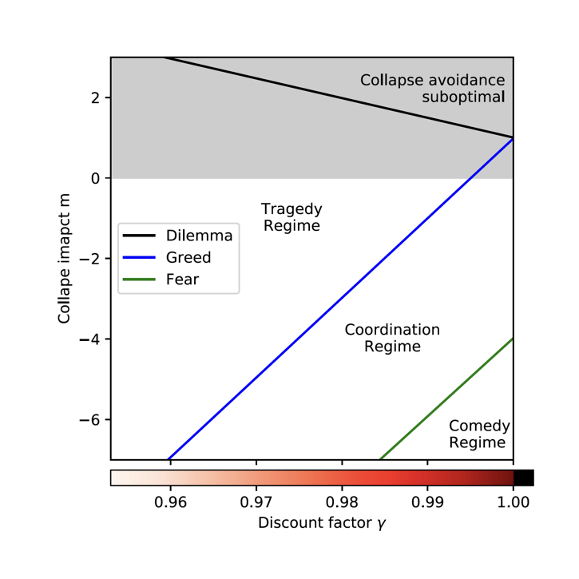
</a>

[Caring for the future can turn tragedy into comedy for long-term collective action under risk of collapse](https://www.pnas.org/content/117/23/12915)
*by* **Barfuss W**, Donges JF, Vasconcelos VV, Kurths J, Levin SA 
*in* Proc. Natl. Acad. Sci. U.S.A., 117(23), 12915-12922 (2020)  
[doi](https://doi.org/10.1073/pnas.1916545117) | [code](https://github.com/wbarfuss/EcoPG) | [zenodo](https://doi.org/10.5281/zenodo.3751564)
 <!-- [ news (PIK)](https://www.pik-potsdam.de/en/news/latest-news/caring-for-the-future-is-key-for-cooperation-to-prevent-climate-collapse-study) | [ news (SRC)](https://www.stockholmresilience.org/research/research-news/2020-06-16-collaboration-in-uncertain-times-can-turn-tragedy-into-comedy.html) -->

---

*I show how multi-agent reinforcement learning dynamics model memory-batch learning agents with an infinite memory batch.* 

<a href="http://www.ifaamas.org/Proceedings/aamas2020/pdfs/p1768.pdf">
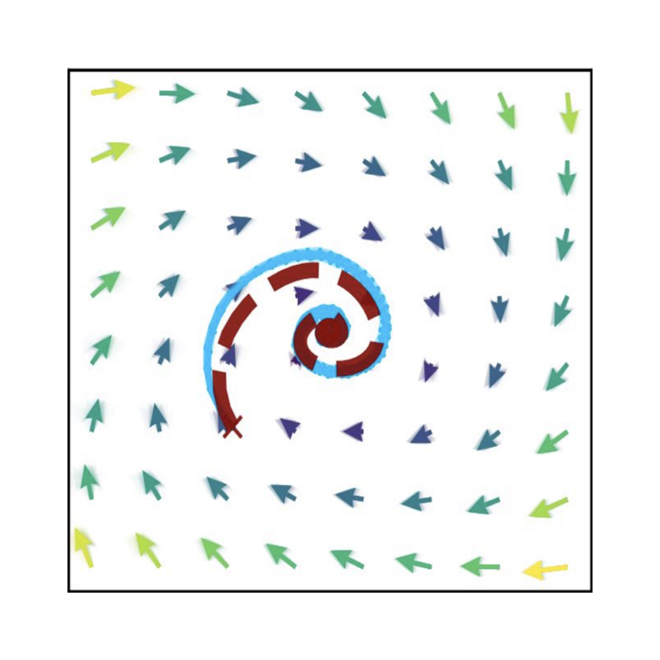
</a>

[Reinforcement Learning Dynamics in the Infinite Memory Limit](http://www.ifaamas.org/Proceedings/aamas2020/pdfs/p1768.pdf)
*by* **Barfuss W**
*in* Proceedings of the 19th International Conference on Autonomous Agents and Multiagent Systems (AAMAS), Auckland, New Zealand, May 9–13 (2020)

---

*We introduce a modeling framework for integrated human-environment modeling up to the planetary scale.* 

<a href="https://esd.copernicus.org/articles/11/395/2020/">
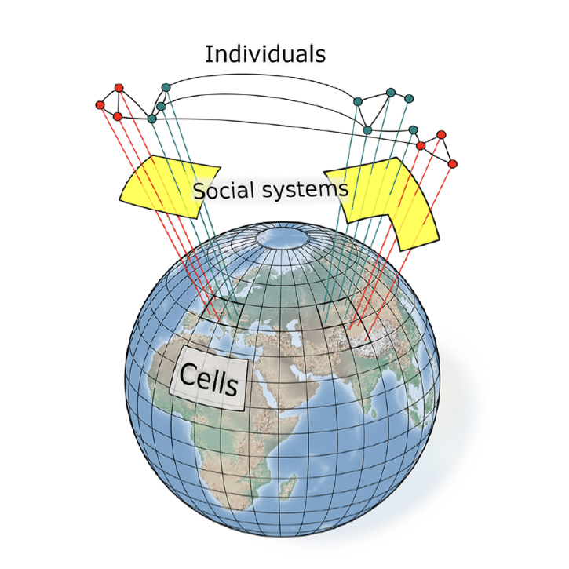
</a>

[Earth system modeling with complex dynamic human societies: the copan:CORE World-Earth modeling framework](https://esd.copernicus.org/articles/11/395/2020/)
*by* Donges JF, Heitzig J, **Barfuss** **W**, Wiedermann M, Kassel JA, Kittel T, Kolb JJ, Kolster T, Müller-Hansen F, Otto IM, Zimmerer KB, Lucht W 
*in* *Earth System Dynamics* 11, 395--413 (2020)  
[doi](https://doi.org/10.5194/esd-11-395-2020) | [discussion paper](https://doi.org/10.5194/esd-2017-126) | [code](https://github.com/pik-copan/pycopancore)

---

<h3 id='2019'>2019 | <a href="#page-top" style="text-decoration: none">🔝</a></h3> 

*We show how deep reinforcement learning can be used to discover ecologically safe and socially just transition pathways towards a sustainable state.*

<a href="https://aip.scitation.org/doi/10.1063/1.5124673">
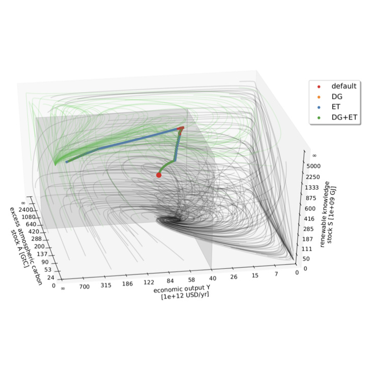
</a>

[Deep reinforcement learning in World-Earth system models to discover sustainable management strategies](https://aip.scitation.org/doi/10.1063/1.5124673)
*by* Strnad FM, **Barfuss W**, Donges JF,  Heitzig J 
*in* Chaos 29, 123122 (2019) 
[doi](https://doi.org/10.1063/1.5124673) | [preprint](https://arxiv.org/abs/1908.05567) | [code](https://github.com/fstrnad/pyDRLinWESM)

---

*We introduce and analyze a multi-level social network model of interacting governance agents, resource users and renewable resources.*

<a href="https://link.springer.com/article/10.1140/epjst/e2019-900120-4">
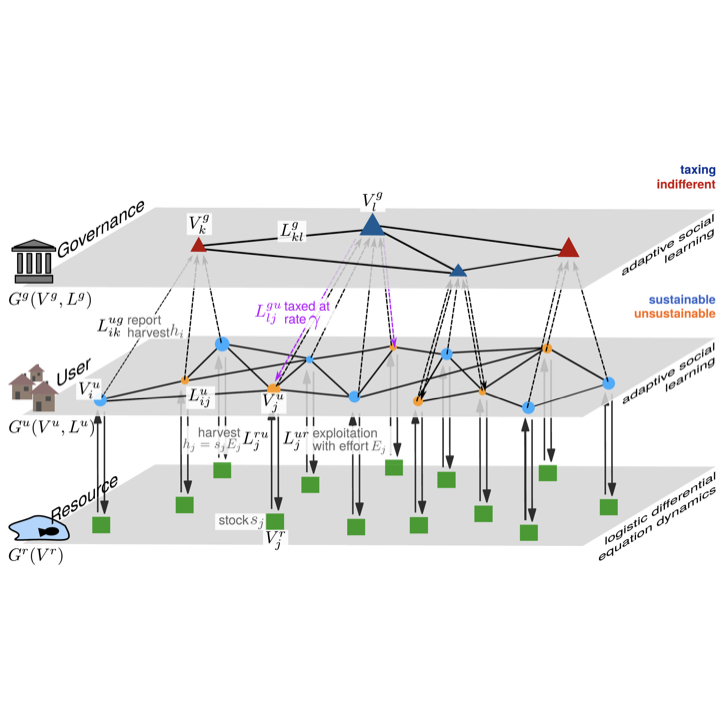
</a>

[The physics of governance networks: critical transitions in contagion dynamics on multilayer adaptive networks with application to the sustainable use of renewable resources](https://link.springer.com/article/10.1140/epjst/e2019-900120-4)
*by* Geier F, **Barfuss W,** Wiedermann M, Kurths J, Donges JF
*in* The European Physical Journal Special Topics, 228 11, 2357-2369 (2019)  
[doi](https://doi.org/10.1140/epjst/e2019-900120-4) | [preprint](https://arxiv.org/abs/1906.08679)

---
*We perform an in-depth study of random assemblies of ellipses in two dimensions.*

<a href="https://pubs.rsc.org/en/content/articlelanding/2019/SM/C9SM01067J">
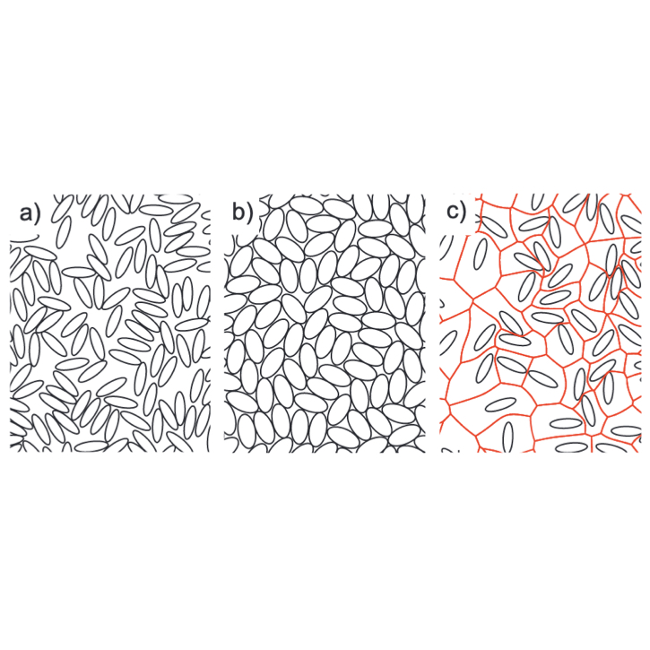
</a>

[Geometric effects in random assemblies of ellipses](https://pubs.rsc.org/en/content/articlelanding/2019/SM/C9SM01067J)
*by* Lovrić J, Kaliman S, **Barfuss W**, Schröder-Turk GE, Smith AS 
*in* Soft Matter, 15, 8566-8577 (2019)  
[dio](https://doi.org/10.1039/C9SM01067J) | [preprint](https://arxiv.org/abs/1905.11777)

---

*In my PhD thesis, I show how multi-agent reinforcement learning dynamics offer a integrating platform to study social-ecological interactions.*

[Learning dynamics and decision paradigms in social-ecological dilemmas](https://edoc.hu-berlin.de/handle/18452/20896)
*by* **Barfuss W**, 
PhD Thesis, Humboldt-Universität zu Berlin (2019)  
[doi](http://dx.doi.org/10.18452/20127)

---
*We derive strategy-average multi-agent reinforcement learning dynamics which can handle stateful environments.*

<a href="https://journals.aps.org/pre/abstract/10.1103/PhysRevE.99.043305">
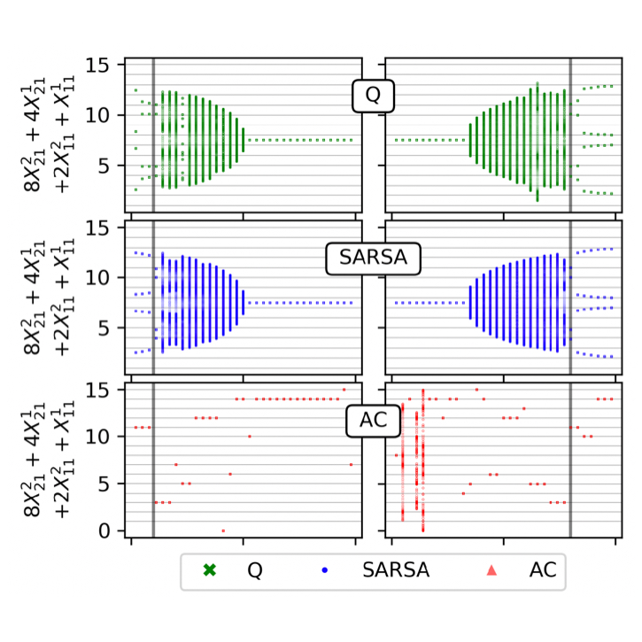
</a>

[Deterministic limit of temporal difference reinforcement learning for stochastic games](https://journals.aps.org/pre/abstract/10.1103/PhysRevE.99.043305)
*by* **Barfuss W**, Donges JF, Kurths J
*in* Physical Review E 99, 043305 (2019)  
[doi](https://doi.org/10.1103/PhysRevE.99.043305) | [preprint](https://arxiv.org/abs/1809.07225) | [code](https://github.com/wbarfuss/DetRL) | [zenodo](https://doi.org/10.5281/zenodo.1495091)

---

<h3 id='2018'>2018 | <a href="#page-top" style="text-decoration: none">🔝</a></h3> 

*We show that no master paradigm exist within the decision paradigms of optimization, sustainability and safety for the governance of a human-environmental tipping element.*

<a href="https://www.nature.com/articles/s41467-018-04738-z">
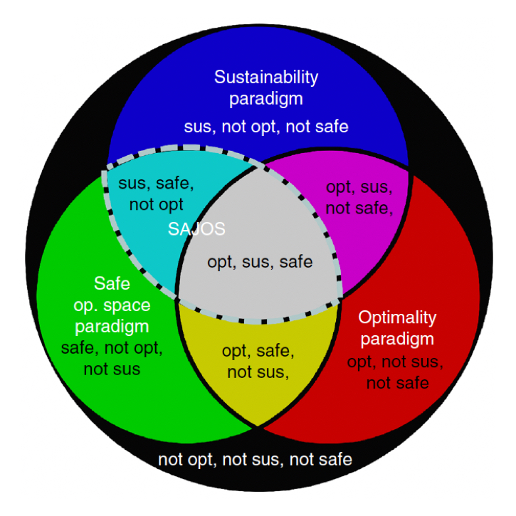
</a>

[When optimization for governing human-environment tipping elements is neither sustainable nor safe](https://www.nature.com/articles/s41467-018-04738-z)
*by* **Barfuss W**, Donges JF, Lade SJ, Kurths J
*in* Nature Communications 9, 2354 (2018)  
[doi](https://doi.org/10.1038/s41467-018-04738-z) | [code](https://github.com/wbarfuss/Paradigms) | [zenodo](https://doi.org/10.5281/zenodo.1495578)

---

*We introduce and analyze a conceptual mathematical model designed to reflect a qualitative decision dilemma humanity might currently face in view of anthropogenic climate change.*

<a href="https://www.mdpi.com/2071-1050/10/6/1947">
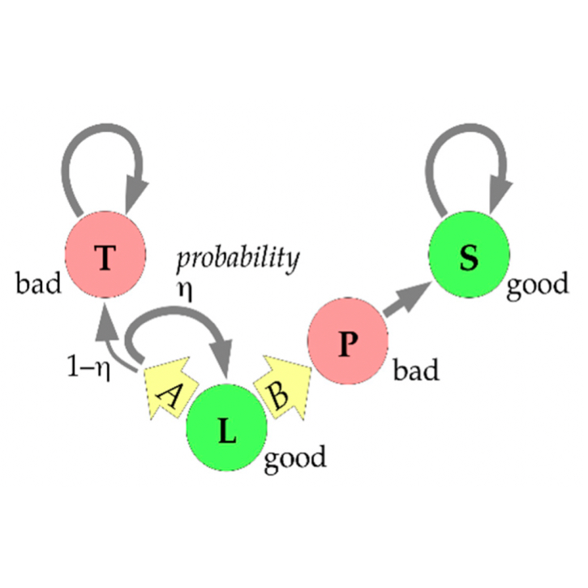
</a>

[A thought experiment on sustainable management of the Earth system](https://www.mdpi.com/2071-1050/10/6/1947) 
*by* Heitzig J, **Barfuss W**, Donges JF
*in* Sustainability 10(6), 1947 (2018)  

[doi](https://doi.org/10.3390/su10061947)

---

<h3 id='2017'>2017 | <a href="#page-top" style="text-decoration: none">🔝</a></h3> 

*We propose a classification of modern notions of social-ecological resilience from a multi-agentenvironment perspective.*

<a href="http://doi.org/10.14512/gaia.26.S1.5">
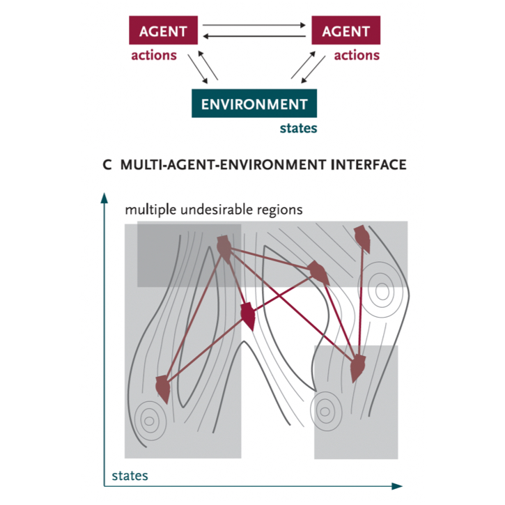
</a>

[From math to metaphors and back again. Social-ecological resilience from a multi-agent-environment perspective](http://doi.org/10.14512/gaia.26.S1.5)
*by* Donges JF, **Barfuss W** 
*in* GAIA 26(S1), 182–190 (2017)  
[doi](http://doi.org/10.14512/gaia.26.S1.5)

---

*We study human-environmen co-evolution using a stylized model of private resource use and social learning on an adaptive social
network.*

<a href="http://dx.doi.org/10.5194/esd-8-255-2017">
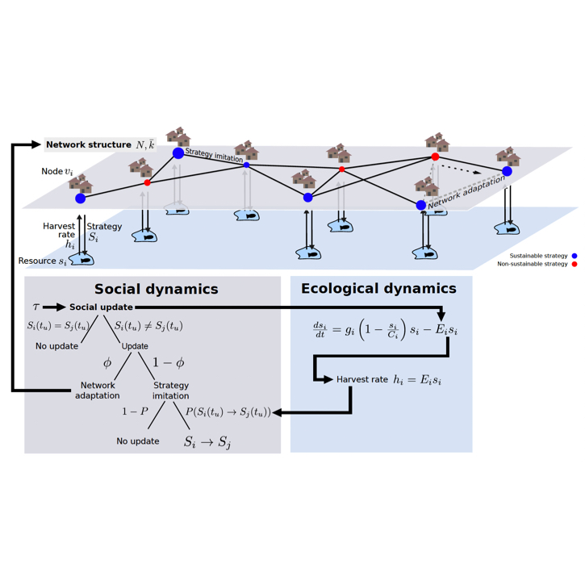
</a>

[Sustainable use of renewable resources in a stylized social-ecological network model under heterogeneous resource distribution](http://dx.doi.org/10.5194/esd-8-255-2017)
*by* **Barfuss W**, Donges JF, Wiedermann M, Lucht W 
*in* Earth System Dynamics 8, 255-264 (2017)  
[doi](http://doi.org/10.5194/esd-8-255-2017) | [discussion paper](https://doi.org/10.5194/esd-2016-15) | [code](https://github.com/wbarfuss/cyexploit) | [zenodo](https://doi.org/10.5281/zenodo.1493202)

---

<h3 id="2016">2016 | <a href="#page-top" style="text-decoration: none">🔝</a></h3> 

*We introduce a computationally efficient and statistically robust method to construct global parsimonious probabilistic models from a simple sum of local inverse covariances.*

<a href="https://journals.aps.org/pre/abstract/10.1103/PhysRevE.94.062306">
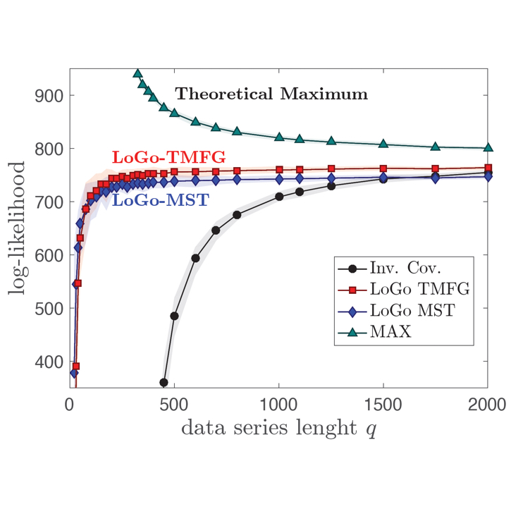
</a>

[Parsimonious modeling with Information Filtering Networks](https://journals.aps.org/pre/abstract/10.1103/PhysRevE.94.062306) 
*by* **Barfuss W**, Massara GP, Di Matteo T, Aste T 
*in* Phys. Rev. E 94, 062306 (2019)  
[doi](http://doi.org/10.1103/PhysRevE.94.062306)

