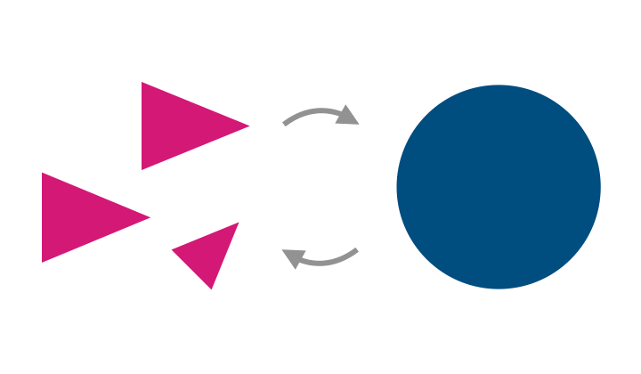

## Collective learning for a sustainable future

We **reshape human-environment modeling** to identify **critical leverage points** for **sustainability transitions**. The dynamics of collective action at scale – in which large collectives of intelligent actors in complex environments seek ways to improve their joint well-being – are critical for a sustainable future, yet unresolved. **The fundamental question is: Are we, as the human species, intelligent enough to maintain our life-support system and organize a good life for all?** To move forward with this challenge, we develop **[formal models of collective learning](]((https://barfusslab.github.io/pyCRLD)**
to better understand how in complex environments, individual decisions become collective action for a sustainable future.

We are **sustainability system scientists**. No single academic discipline alone is up to the task. We are a young, strongly evolving, interdisciplinary team building bridges between Complex System Science, Multi-Agent Reinforcement Learning, Cognitive Science, Social-Ecological Resilience, and Sustainability Economics. To merge all of these perspectives, we practice humility in collective learning.

We focus on excellence in developing **theory-driven computational models**. They bridge mathematical with computational modeling to eventually reshape our mental and verbal models of Nature-Society relationships. We make our models and their assumptions fully transparent, open source, and reproducible. We also educate the next generation of sustainability system modelers. Why? To **initiate large-scale collective learning for a sustainable future**.

---
[Publications](publications.html) 

<!-- 
## Research themes
[Collective Learning Dynamics](mission.html#cld)

[Collective Learning Dynamics](mission.html#cld)

[Collective Learning Dynamics](mission.html#cld)

<h3 id="cld">Collective learning dynamics</h3>
How do individuals learn from each other to form collective action?

<!-- <h2 id="selected-talks">Selected talks</h2>

* [Collective Cooperative Intelligence](https://yewtu.be/watch?v=gHR6xv3xiqE) - May, 2022 <iframe src='https://yewtu.be/embed/gHR6xv3xiqE' width="100%" height="350" frameborder='0' class="rounded-md" ></iframe>

* [Non-linear dynamics of multi-agent reinforcement learning in partially observable environments](https://yewtu.be/watch?v=OFYWI46nn0E) - May, 2022 <iframe src='https://yewtu.be/embed/OFYWI46nn0E' width="100%" height="350" frameborder='0' class="rounded-md" ></iframe> -->